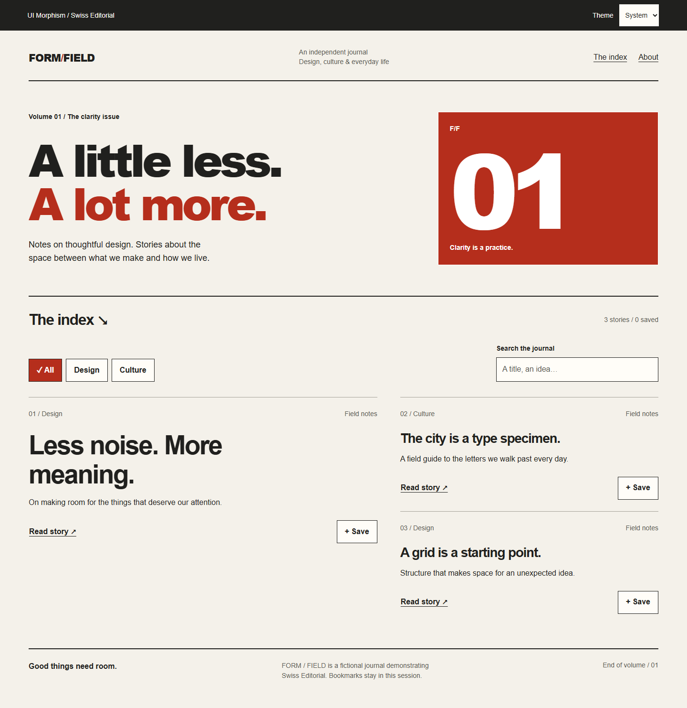

# UI Morphism Design Intelligence

This repository is a reusable frontend design skill for selecting and implementing UI morphism styles in production products across web and application renderers.

## Current contract

Version `1.7.0` supports eleven visual styles, adding **Swiss Editorial** for journals, research libraries, and typography-led portfolios. It includes an interactive React preview with search, category filters, article disclosure, local bookmarks, and system/light/dark themes, plus Flutter and React Native seeds. `SKILL.md` is the source of truth; `skill.json` declares the supported styles, platforms, workflow, and contract references.

## Try the interactive example



Use Node.js 22.12+ or 24+ and npm. From the repository root:

```bash
npm ci
npm run dev
```

Open the local URL printed by Vite. The preview imports `skills/swiss-editorial/example.tsx` directly. Filters, search, inline reading, and save/unsave actions work locally; bookmarks reset when the page reloads. The journal and its stories are fictional sample content. No account, backend, remote fonts, or API keys are required.

```bash
npm run build
npm run preview
```

The production build is written to `dist/`. To reuse the style, start with its [skill](skills/swiss-editorial/SKILL.md), [component recipes](skills/swiss-editorial/components.md), and [platform mappings](skills/swiss-editorial/platforms.md). See the [verification record](skills/swiss-editorial/verification.md) for tested behavior and native limitations.

## Code-first, cross-platform usage

Every style directory contains:

- `SKILL.md`: when to use, visual system, risks, accessibility, and anti-patterns.
- `components.md`: component-level recipes for buttons, cards, inputs, navigation, states, opacity, blur, shadows, radius, borders, and responsive behavior.
- `platforms.md`: how the same visual intent maps to HTML/CSS, React, Flutter, React Native, and other renderers.
- `example.css`: a runnable web/CSS starter.
- `example.tsx`: a runnable React/semantic HTML starter.
- `example.flutter.dart`: a Flutter implementation seed using native/theme primitives.
- `example.native.tsx`: a React Native implementation seed using native interaction primitives and deterministic fallbacks.

An agent should read all style files above before implementing a selected style. Do not output only generic visual advice; use the concrete recipes and platform mappings, then adapt tokens and primitives to the project.

## Agent output contract

`references/component-code-contract.md` requires an auditable sequence:

`decision record -> semantic token record -> component recipes -> platform mappings -> responsive/accessibility rules -> fallback rule -> verification record`

For generated or modified examples, record what was verified instead of treating the presence of visual code as proof of correctness.

## Semantic token and theme contract

`references/token-convention.md` is the canonical naming and theme contract. Reusable tokens use the grammar:

`--um-<style>-<group>[-<variant>]`

Use full style names rather than short aliases, keep style tokens separate from semantic roles, expose opaque fallback surfaces for translucent styles, and provide focus fallbacks that do not depend only on `box-shadow`. Explicit `[data-theme="dark"]` and `[data-theme="light"]` choices must override system preference where theme switching is implemented.

## Platform capability negotiation

`references/platform-matrix.md` is the capability decision table for HTML/CSS, React, Flutter, and React Native. It distinguishes `Native`, `Adapt`, and `Fallback` behavior and separates `Required`, `Preferred`, and `Optional` effects.

The deterministic degradation path is:

`full effect -> reduced effect -> opaque/static effect -> simpler native surface`

Unsupported effects must not change content priority, semantic state, accessibility, responsive behavior, or interaction target size.

## React Native examples

Every style includes `example.native.tsx`. These seeds preserve semantic roles and state through `Pressable` or other native primitives, respond to available width, target at least 48px for primary tappable controls, and document what survives when decorative effects are removed.

## Core contracts

- `references/comparison-matrix.md` — style selection and depth/cost guidance.
- `references/component-code-contract.md` — required component/state output and auditable agent workflow.
- `references/platform-contract.md` — framework-agnostic implementation and fallback rules.
- `references/platform-matrix.md` — renderer capability matrix and capability negotiation.
- `references/platform-implementation-guide.md` — semantic tokens, capability negotiation, and verification workflow.
- `references/quality-gates.md` — production-readiness checks for semantics, responsiveness, motion/fallback, target size, effect budget, and cross-platform equivalence.
- `references/react-native-adapter.md` — canonical React Native role/state/token/responsive/accessibility/fallback mapping.
- `references/token-convention.md` — canonical token namespace, accessibility token rules, and theme override behavior.

## Supported platforms

HTML/CSS, React, Flutter, React Native, and other renderers through the adapter contract.

## Validation

Run the repository validators locally:

```bash
node scripts/validate-repo.mjs
node scripts/validate-quality-gates.mjs
```

The dependency-free validators check documentation and source contracts. They do not establish runtime correctness. The interactive example also has TypeScript/build checks and browser behavior/accessibility tests:

```bash
npm run build
npx playwright install chromium
npm test
```

GitHub Actions runs both validators, builds the preview, and runs the browser suite on pushes and pull requests targeting `main`. Browser tests cover the new Swiss Editorial example; the ten older styles retain their existing static validation coverage.

## Supported styles

Skeuomorphism, Flat Design, Neumorphism, Material Design, Glassmorphism, Claymorphism, Liquid Glass, Aurora UI, Bento UI, Neobrutalism, and Swiss Editorial.

## Design principle

Choose one primary visual language and at most one supporting style. Treat Bento as a layout system and Aurora as an atmospheric accent unless the product specifically calls for broader use. Translate semantic intent across renderers; never make blur, texture, glow, shadow, transparency, or animation the only source of meaning. Advanced effects must have a deterministic fallback, and native/standard interaction primitives should be preferred over custom painted controls.
